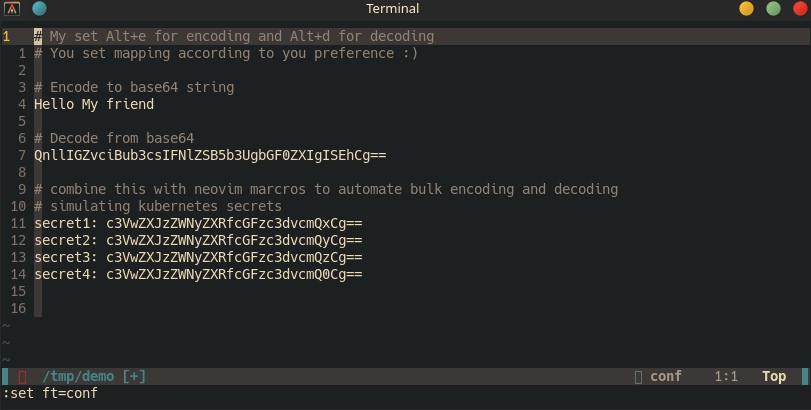

# Based64.nvim
Based64.nvim is a Neovim Lua plugin designed to simplify base64 encoding and decoding tasks directly within Neovim, enhancing your workflow and productivity.


## Installation

You can install Based64.nvim using your preferred Neovim plugin manager. Below is an example configuration using the Lazy package manager:

```lua
return {
  "thangeshbabu/based64.nvim",
  config = function()
    local based64 = require('based64')
    
    -- Set key mappings for encoding and decoding
    vim.keymap.set('v', '<M-e>', function() based64.encode() end, { remap = true, silent = true })
    vim.keymap.set('v', '<M-d>', function() based64.decode() end, { remap = true, silent = true })
  end
}
```

## Usage

After installing Based64.nvim and configuring it as shown above, you can easily encode and decode base64 strings within Neovim:

- **Encoding**: Select the text you want to encode in visual mode and press `Alt+e`.
- **Decoding**: Select the base64 string you want to decode in visual mode and press `Alt+d`.

That's it! With Based64.nvim, you can streamline your base64 tasks and stay focused on your coding without switching between Neovim and the command line.

## Feedback and Contributions

If you encounter any issues or have suggestions for improvement, feel free to open an issue or pull request on the [GitHub repository](https://github.com/thangeshbabu/based64.nvim). Your feedback is highly appreciated!
